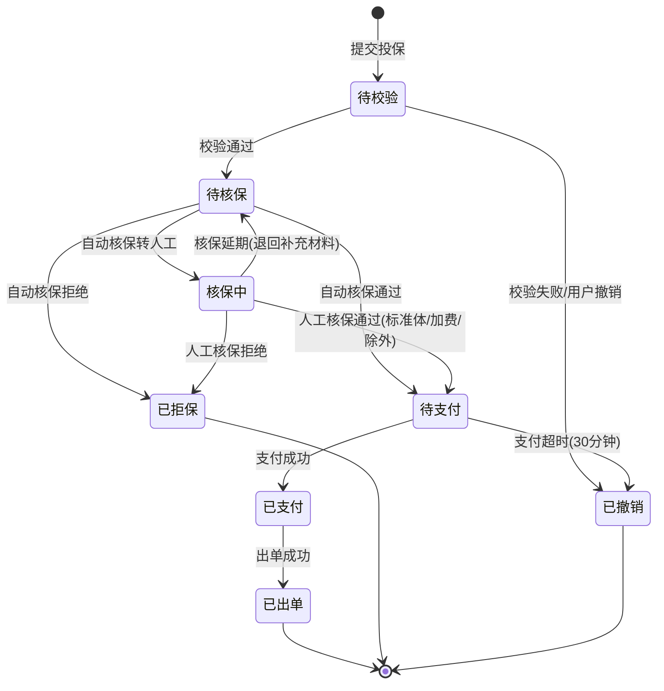
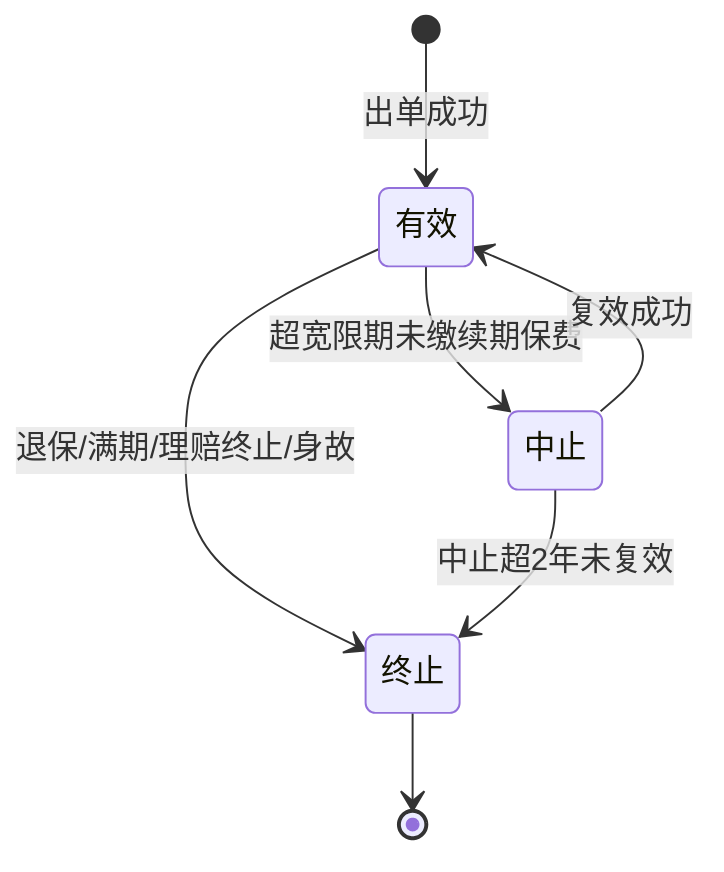
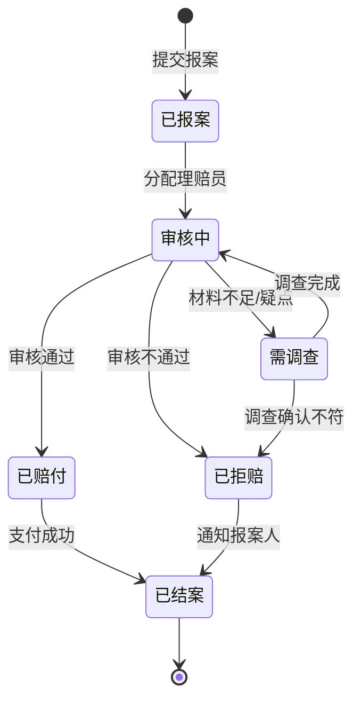
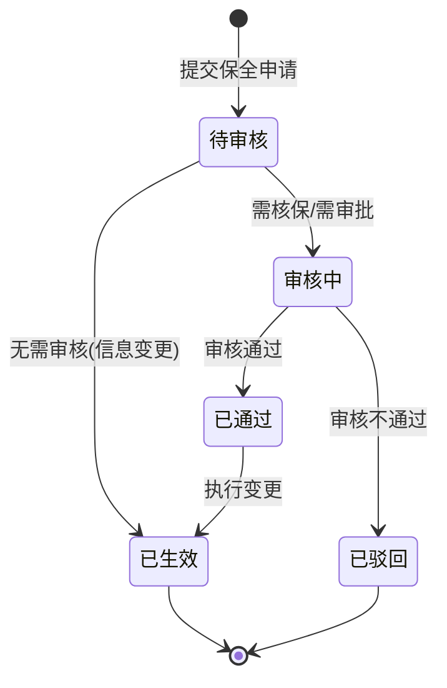
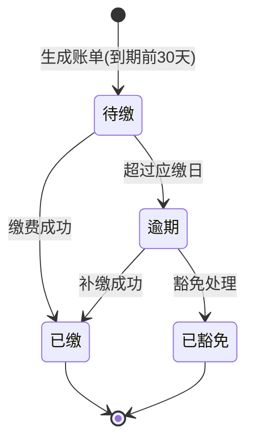

# Covex 运营域需求规格

> **版本**：v3.0（拆分版 - 纯需求文档）
> **内容**：用户故事、状态机、端到端流程、异常处理、跨域数据流
> **配套文档**：`Covex数据模型-运营域.md`（表结构定义）
> **方法论**：INVEST 用户故事 + BDD 验收标准 + MoSCoW 优先级

---


## 全局非功能需求


| 维度 | 要求 |
|---|---|
| 响应时间 | API P95 < 200ms，复杂查询 < 1s |
| 并发 | 支持 1000 TPS 投保请求 |
| 数据安全 | PII 数据加密存储，操作审计全记录 |
| 多租户 | 所有查询强制 tenant_id 隔离 |
| 幂等性 | 支付、出单、赔付操作必须幂等 |


- **M** = MUST（必须，无此功能系统不可用）
- **S** = SHOULD（应该，影响体验但不阻塞上线）
- **C** = COULD（可以，锦上添花）
- **W** = WON'T（暂不做，后续版本）

---

## 一、渠道域

### Epic 1：渠道商管理

#### Story 1.1：渠道商入驻

```
As a 渠道管理员
I want to 录入渠道商基本信息并提交资质审核
So that 新渠道商可以接入平台并获取产品授权

Acceptance Criteria:
Given 渠道管理员登录系统
When 填写渠道商信息（名称/类型/资质证件/联系人）并点击"提交审核"
Then 渠道商状态变为"待审核"
And 系统记录提交时间
And 审核人员收到待办通知
```

#### Story 1.2：渠道商产品授权

```
As a 渠道管理员
I want to 为已签约渠道商授权可售产品并设置佣金比例
So that 渠道商只能销售被授权的产品并按约定比例获取佣金

Acceptance Criteria:
Given 渠道商状态为"已签约"
When 管理员选择产品并设置佣金比例（如首年15%、续期5%）
Then 该产品出现在渠道商的可售产品列表中
And 佣金比例记录在授权表中
And 渠道商端可实时查看新增的可售产品
```

#### Story 1.3：佣金结算

```
As a 财务管理员
I want to 按月度自动计算各渠道商的应结佣金
So that 佣金结算准确且可追溯

Acceptance Criteria:
Given 月度结束（每月1日00:00）
When 系统执行佣金结算任务
Then 统计该渠道商上月所有出单记录
And 按每笔保单的佣金比例计算应结金额
And 生成佣金结算单（状态：待确认）
And 财务管理员可查看明细并确认/驳回
```

## 二、客户域

### Epic 2：客户管理

#### Story 2.1：客户信息录入与查重

```
As a 代理人/投保人
I want to 录入客户基本信息（姓名/证件/联系方式）
So that 该客户可以作为投保人或被保人发起投保

Acceptance Criteria:
Given 代理人进入客户管理页面
When 填写客户信息并通过证件号查重
Then 如证件号已存在，提示"客户已存在"并展示已有信息
And 如不存在，创建新客户记录（ins_customer），role_flags 为空
And 证件号格式校验（身份证18位/护照/军官证等）
```

#### Story 2.2：客户角色扩展

```
As a 系统设计
I want to 同一自然人在首次投保时自动创建角色扩展记录
So that 投保人属性和被保人属性分别管理，互不干扰

Acceptance Criteria:
Given 客户A首次作为投保人发起投保
When 系统创建投保单
Then 自动创建 ins_customer_applicant 记录（收入、与被保人关系等）
And ins_customer.role_flags 追加 "applicant"
And 同一客户再次作为投保人时，不重复创建，直接引用已有记录

Given 客户A作为被保人
When 系统创建投保单
Then 自动创建 ins_customer_insured 记录（健康档案、职业风险等）
And ins_customer.role_flags 追加 "insured"
```

#### Story 2.3：健康档案管理

```
As a 核保员
I want to 查看被保人的完整健康档案
So that 核保决策基于全面的健康信息

Acceptance Criteria:
Given 被保人A有多次投保记录
When 核保员查看A的健康档案（ins_customer_insured）
Then 展示既往病史、吸烟/饮酒状态、BMI、家族病史
And 每次投保的健康告知答案可追溯（关联 ins_proposal.health_declaration）
And 健康档案跨保单共享，新投保时自动带入已有信息
```

#### Story 2.4：银行账户管理

```
As a 投保人
I want to 维护我的银行账户信息
So that 保费自动扣款和理赔金收款使用正确的账户

Acceptance Criteria:
Given 投保人进入银行账户管理页面
When 添加新银行账户（开户行/账号/户名）
Then 系统校验户名与客户姓名一致
And 支持设置默认缴费账户和默认收款账户
And 一个客户可以有多个银行账户
And 账户删除时需校验无未完成的自动扣款协议
```

#### Story 2.5：联系地址管理

```
As a 客户/代理人
I want to 维护多个联系地址（户籍/常住/工作/通讯）
So that 保单通知和纸质材料寄送到正确地址

Acceptance Criteria:
Given 客户需要设置不同用途的地址
When 添加地址并选择地址类型
Then 每种类型可设一个默认地址
And 保单寄送地址优先使用通讯地址，无则用常住地址
```

## 三、承保域

### Epic 3：投保与出单

#### Story 3.1：发起投保

```
As a 代理人/投保人
I want to 选择产品、填写投保信息并提交投保申请
So that 系统生成投保单并进入核保流程

Acceptance Criteria:
Given 代理人选择一个已上架且已授权的产品
When 填写投保人信息、被保人信息、选择保障责任和缴费计划
And 勾选健康告知（如需要）
And 点击"提交投保"
Then 系统创建投保单（proposal），状态为"待校验"
And 触发 LiteFlow 校验链（validate）
And 校验通过后状态变为"待核保"
And 校验失败则返回具体错误项
And 投保单 operator 字段填写当前操作人账号（代理人或投保人）
```

#### Story 3.2：核保审核

```
As a 核保员
I want to 查看待核保的投保单并给出核保结论
So that 风险可控的投保通过审核，高风险投保被拒或加费

Acceptance Criteria:
Given 投保单状态为"待核保"
When 自动核保链（underwrite）执行完毕
And 结论为"转人工"
Then 该投保单进入核保员工作台
And 核保员可查看投保详情、健康告知、累计风险保额
And 核保员可选择结论：标准体/加费/除外/延期/拒保
And 加费时填写加费金额
And 除外时填写除外责任描述
And 核保结论记录到 ins_underwriting_record
```

#### Story 3.3：保费计算与支付

```
As a 投保人
I want to 看到准确的保费金额并完成支付
So that 投保流程完成，保单生效

Acceptance Criteria:

AC-1: 保费计算
Given 投保单核保通过
When 系统调用 Aviator 表达式计算保费
Then 显示保费金额（含加费如有）

AC-2: 支付回调处理
Given 投保人选择支付方式并完成支付
When 支付回调到达系统
Then ins_payment.status=2（已支付）
And ins_proposal.status=5（已支付，等待出单）
And 发送 PROPOSAL_PAID 消息到 RocketMQ（payload: proposalId）
And 支付记录 operator 填 SYSTEM（回调自动处理）；人工退款时填财务账号

AC-3: 异步出单触发
Given 投保单已处于已支付状态（status=5）
When ProposalPaidConsumer 消费 PROPOSAL_PAID 消息
Then 调用 PolicyService.issuePolicy() 执行出单链
And 出单成功：ins_proposal.status=6（已出单），ins_policy.status=有效，生成保单号
And 异步触发：POLICY_ISSUED MQ → 佣金记录 + 承保通知

AC-4: 出单失败兜底
Given ProposalPaidConsumer 消费 PROPOSAL_PAID 消息
When issuePolicy() 执行失败（出单链异常/DB 错误）
Then ins_proposal.status 保持 5（已支付）
And 记录错误日志（含 proposalId + 失败原因）
And 人工可通过 POST /api/policy/issue/{proposalId} 重试出单
```

> **实现计划**：`Covex补充计划20260706.md` Task 3.5（支付→出单 MQ 集成）

#### Story 3.4：保单生成

```
As a 系统
I want to 从投保单信息实例化保单及其明细
So that 保单独立于产品配置存在，即使产品下架也不影响已有保单

Acceptance Criteria:
Given 投保单支付成功
When 系统执行出单流程
Then 创建 ins_policy（复制产品基本信息快照）
And 创建 ins_policy_coverage（复制保障责任+保额+保费）
And 创建 ins_policy_premium（复制缴费计划）
And 保单状态设为"有效"
And 保单号全局唯一，格式：{租户编码}{年份}{流水号}
```

## 四、保单服务域

### Epic 4：续期管理

#### Story 4.1：续期账单生成

```
As a 系统
I want to 在续期保费到期前自动生成续期账单并发送缴费提醒
So that 投保人按时缴费，保单不会因逾期中止

Acceptance Criteria:
Given 保单为期交且状态为"有效"
When 距下期应缴日还有30天（可配置）
Then 系统自动生成续期账单（ins_renewal_bill）
And 发送短信/推送通知投保人
And 在到期日前7天、3天、到期当天各提醒一次
```

#### Story 4.2：保单中止与复效

```
As a 投保人
I want to 在保单中止后2年内申请复效
So that 我可以恢复保单效力而不必重新投保

Acceptance Criteria:
Given 保单超过宽限期未缴费，状态变为"中止"
When 投保人在中止后2年内申请复效
Then 系统校验复效条件（健康告知、补缴保费+利息）
And 如需要核保则进入核保流程
And 复效通过后保单状态恢复为"有效"
And 缴费计划续接
```

### Epic 5：保全变更

#### Story 5.1：信息变更

```
As a 保单持有人
I want to 变更保单的联系信息（地址/电话/受益人）
So that 保单信息保持最新

Acceptance Criteria:
Given 保单状态为"有效"
When 保单持有人提交信息变更申请（如变更受益人）
Then 系统创建保全申请（ins_endorsement）
And 受益人变更需要投保人签名确认
And 变更生效后记录到 ins_endorsement_change
And 保单的 beneficiaries JSON 同步更新
```

#### Story 5.2：退保

```
As a 保单持有人
I want to 申请退保并获取退保金
So that 我可以提前终止保单并拿回部分资金

Acceptance Criteria:
Given 保单状态为"有效"且有现金价值
When 保单持有人提交退保申请
Then 系统调用 LiteFlow 退保链计算退保金
And 犹豫期内退保 → 全额退还（扣工本费）
And 犹豫期外退保 → 按现金价值退还
And 退保金确认后触发支付
And 保单状态变为"终止"，终止原因="退保"
```

## 五、理赔域

### Epic 6：理赔处理

#### Story 6.1：理赔报案

```
As a 报案人（投保人/被保人/代理人）
I want to 在线提交理赔报案信息
So that 理赔流程启动，保险公司开始审核

Acceptance Criteria:
Given 保单状态为"有效"且事故发生在保障期间内
When 报案人填写出险信息（时间/地点/原因/损失描述）
And 上传理赔材料（医疗单据/事故证明/身份证明）
Then 系统创建理赔案件（ins_claim），状态为"已报案"
And 自动校验保单有效性和等待期
And 分配理赔员（claim_handler 填分配的理赔员账号）
```

#### Story 6.2：理赔审核

```
As a 理赔员
I want to 审核理赔材料并做出理赔结论
So that 合理的理赔请求得到赔付，不合理的被拒绝

Acceptance Criteria:
Given 理赔案件状态为"已报案"
When 理赔员执行审核链（LiteFlow claim）
Then 系统自动校验：保单有效性、保障责任匹配、等待期、免赔额、赔付限额
And 理赔员可查看自动校验结果
And 做出结论：正常赔付/部分赔付/拒赔/需调查
And 赔付时自动计算赔付金额（Aviator 表达式）
And 理赔结论记录到 ins_claim_review
```

#### Story 6.3：理赔支付

```
As a 系统
I want to 在理赔结论为赔付时自动触发支付
So that 被保险人及时获得理赔金

Acceptance Criteria:
Given 理赔结论为"正常赔付"或"部分赔付"
When 理赔审核完成
Then 创建支付记录（ins_payment，类型=理赔金）
And 触发支付流程（对接支付通道）
And 支付成功后理赔案件状态变为"已结案"
And 更新保单的累计已赔付金额
And 如累计赔付达到保额上限，保单对应责任终止
And 赔付记录（ins_claim_payment）operator 填 SYSTEM（自动打款）；人工处理时填理赔财务账号
```

## 六、基础服务层

### Epic 7：用户与权限

#### Story 7.1：角色权限配置

```
As a 系统管理员
I want to 创建角色并为角色分配操作权限和数据权限
So that 不同岗位的人员只能访问其职责范围内的功能和数据

Acceptance Criteria:
Given 管理员进入权限管理页面
When 创建角色"核保员"并分配权限
Then 操作权限：查看投保单、执行核保、查看客户信息
And 数据权限：仅看到分配给自己的待核保案件（按区域/渠道筛选）
And 角色创建后可分配给用户
```

#### Story 7.2：数据权限隔离

```
As a 渠道管理员
I want to 只能查看和管理我负责区域的渠道商
So that 不同区域的管理员互不干扰

Acceptance Criteria:
Given 管理员A负责"华东区"，管理员B负责"华南区"
When 管理员A登录系统查看渠道商列表
Then 只显示华东区的渠道商
And 管理员A无法查看或修改华南区的数据
```

## 九、核心实体状态机

### 9.1 投保单状态机



**状态说明**：

| 状态 | 编码 | 触发条件 | 后续动作 |
|---|---|---|---|
| 待校验 | 1 | 用户提交投保 | 触发 LiteFlow validate 链 |
| 待核保 | 2 | 校验链全部通过 | 触发 LiteFlow underwrite 链 |
| 核保中 | 3 | 自动核保结论为"转人工" | 分配核保员，进入工作台 |
| 待支付 | 4 | 核保通过（自动或人工） | 生成支付链接，推送通知 |
| 已支付 | 5 | 支付回调确认 | 发送 PROPOSAL_PAID MQ 消息，等待 ProposalPaidConsumer 触发出单链 |
| 已出单 | 6 | 出单链执行成功 | 生成保单，异步触发通知 |
| 已拒保 | 7 | 核保结论为拒保 | 通知投保人，记录原因 |
| 已撤销 | 8 | 用户主动撤销/支付超时 | 释放占用资源 |

### 9.2 保单状态机



**终止原因编码**：

| 原因 | 编码 | 说明 |
|---|---|---|
| 满期终止 | 1 | 保险期间届满，无续保 |
| 退保终止 | 2 | 保单持有人主动退保 |
| 犹豫期退保 | 3 | 签收后犹豫期内退保 |
| 理赔终止 | 4 | 累计赔付达保额上限 |
| 身故终止 | 5 | 被保人身故（寿险/意外险） |
| 复效超期 | 6 | 中止超2年未申请复效 |
| 拒保终止 | 7 | 复效核保被拒 |

### 9.3 理赔案件状态机



### 9.4 保全申请状态机



### 9.5 续期账单状态机



---

## 十、端到端业务流程

### 10.1 投保→出单全链路

```
步骤1：选择产品
├── 代理人/投保人浏览可售产品列表（ins_channel_product 授权过滤）
├── 查看产品详情（从 ins_product + ins_product_coverage + ins_product_premium 加载）
└── 确认主险 + 选择附加险（ins_product_rider_rel 校验关联合法性）

步骤2：填写投保信息
├── 录入/选择投保人 → 创建或引用 ins_customer + ins_customer_applicant
├── 录入/选择被保人 → 创建或引用 ins_customer + ins_customer_insured
├── 设置受益人 → 存入 ins_proposal.beneficiaries JSON
├── 选择保障责任 + 保额 → 存入 ins_proposal.selected_coverages JSON
├── 选择缴费计划 → 存入 ins_proposal.selected_premium_plan JSON
├── 选择银行账户 → 引用 ins_customer_bank_account
└── 填写健康告知（如需要）→ 存入 ins_proposal.health_declaration JSON

步骤3：系统校验（LiteFlow validate 链）
├── 年龄校验：投保人≥18岁，被保人在产品允许的年龄范围内
├── 证件校验：证件号格式 + 有效期
├── 保额校验：不超过产品上限，累计风险保额不超限
├── 主附险校验：附加险必须在主险允许范围内
├── 渠道校验：渠道商有该产品的销售授权且在有效期内
└── 校验结果：全部通过 → 进入步骤4；有失败项 → 返回具体错误

步骤4：核保（LiteFlow underwrite 链）
├── 规则引擎执行核保规则（ins_product_rule 中 rule_type=1 的规则）
│   ├── 健康告知评估：对比 ins_customer_insured.medical_history
│   ├── 职业风险评估：查询 ins_customer_insured.occupation_risk_level
│   ├── 财务核保：高保额时校验投保人年收入
│   └── 累计风险评估：查询该被保人所有有效保单的累计保额
├── 核保结论：
│   ├── 标准体通过 → 进入步骤5
│   ├── 加费 → 计算加费金额，更新保费，进入步骤5
│   ├── 除外 → 标记除外责任，进入步骤5
│   ├── 转人工 → 创建 ins_underwriting_record(uw_type=2)，等待核保员
│   ├── 延期 → 通知投保人补充材料，投保单退回"待核保"
│   └── 拒保 → 投保单状态→已拒保，通知投保人
└── 人工核保：核保员在工作台审核 → 给出结论 → 同上述分支

步骤5：保费计算（Aviator 表达式）
├── 从 Redis 加载费率表：ins:rate:{rate_table_code}:{version}
├── 执行保费计算公式（ins_product_rule 中 rule_type=5 的规则）
│   ├── 寿险：premium = sumInsured × rate(age, gender, term)
│   ├── 车险：premium = basePremium × ncdFactor × vehicleFactor × regionFactor
│   └── 加费处理：如有核保加费，叠加到标准保费
├── 取整处理：按 rounding_mode 取整
└── 展示最终保费 → 进入步骤6

步骤6：支付
├── 生成支付链接 → 投保人选择支付方式
├── 调用支付通道（微信/支付宝/银行）
├── 创建 ins_payment 记录（status=1 待支付）
├── 等待支付回调（超时30分钟 → 投保单→已撤销）
├── 支付回调到达 → ins_payment.status=2，ins_proposal.status=5
└── 发送 PROPOSAL_PAID 消息到 RocketMQ（异步桥接步骤7）

步骤6→7 桥接（MQ 异步触发）：
├── ProposalPaidConsumer 消费 PROPOSAL_PAID 消息
├── 调用 PolicyService.issuePolicy(proposalId)
├── 成功 → 进入步骤7完成
└── 失败 → ins_proposal 保持 status=5，日志告警，人工 POST /api/policy/issue/{id} 重试

步骤7：出单（LiteFlow issue 链，由 ProposalPaidConsumer 触发）
├── 创建保单 ins_policy（从投保单实例化）
├── 创建保单险种明细 ins_policy_coverage（快照保障责任+保额+保费）
├── 创建保单缴费计划 ins_policy_premium（快照缴费安排）
├── 生成保单号（全局唯一）
├── 保单状态 → 有效
├── 投保单状态 → 已出单（status=6）
└── 发送 POLICY_ISSUED 消息 → 异步触发：
    ├── 计算佣金 → 创建 ins_commission 记录
    ├── 更新被保人累计风险保额
    └── 如有再保安排 → 触发再保通知
```

### 10.2 续期→中止→复效流程

```
续期正常流程：
├── T-30天：系统生成 ins_renewal_bill（status=1 待缴）
├── T-30天：发送第一次缴费提醒
├── T-7天：发送第二次缴费提醒
├── T-3天：发送第三次缴费提醒
├── T日（应缴日）：
│   ├── 如已设置代扣协议 → 自动扣款 → 成功则 ins_renewal_bill.status=2
│   └── 未扣款/扣款失败 → 进入宽限期
├── T+N天（宽限期内，通常60天）：
│   ├── 投保人主动缴费 → ins_payment + ins_renewal_bill.status=2 → 保单续期
│   └── 宽限期结束仍未缴 → 保单状态→中止
│
中止期间：
├── 保单状态=中止，保障暂停
├── 中止期间出险 → 不予赔付
├── 持续发送复效提醒（每季度一次）
│
复效流程（中止后2年内）：
├── 投保人提交复效申请 → 创建 ins_endorsement(endorsement_type=6)
├── 补缴欠缴保费 + 利息（按保单借款利率计算）
├── 如产品要求 → 重新健康告知 → 进入核保流程
│   ├── 核保通过 → 保单状态→有效，ins_policy_premium.paid_periods 续接
│   ├── 核保拒绝 → 保全申请→已驳回
│   └── 核保加费/除外 → 保全申请→已通过（附条件）
│
超期处理（中止超2年）：
└── 保单状态→终止，termination_reason=6（复效超期）
```

### 10.3 理赔→赔付流程

```
步骤1：报案
├── 报案人登录系统 → 选择保单 → 选择险种（ins_policy_coverage）
├── 填写出险信息：事故日期/类型/描述/地点
├── 上传理赔材料（ins_claim_document）
├── 系统自动校验：
│   ├── 保单有效性：保单状态=有效
│   ├── 保障期间：事故日期在生效日和到期日之间
│   ├── 等待期校验：事故日期距生效日已超过等待期
│   └── 险种匹配：出险类型在该保障责任范围内
├── 校验通过 → 创建 ins_claim(status=1 已报案)
└── 校验失败 → 返回具体原因（保单无效/不在保障范围/等待期内）

步骤2：立案与分配
├── 系统自动分配理赔员（按区域/险种/案件量轮转）
├── ins_claim.claim_handler = 分配的理赔员
├── ins_claim.status = 2（审核中）
└── 理赔员收到待办通知

步骤3：审核（LiteFlow claim 链）
├── 自动校验：
│   ├── 材料完整性：必要材料是否齐全
│   ├── 免赔额计算：claim = loss - deductible
│   ├── 赔付限额：claim ≤ max_benefit - already_paid
│   ├── 赔付比例：claim = claim × claim_ratio
│   └── 反欺诈规则：异常模式检测（短期多次理赔、金额异常等）
├── 理赔员审核：
│   ├── 查看自动校验结果
│   ├── 审核材料真实性
│   └── 做出结论 → 创建 ins_claim_review
│       ├── 正常赔付 → approved_amount = 计算金额
│       ├── 部分赔付 → approved_amount < claim_amount（说明原因）
│       ├── 拒赔 → reject_reason = 具体原因
│       └── 需调查 → ins_claim.status = 3
└── 调查流程（如需要）：
    ├── 分配调查员
    ├── 实地调查/医院核实/公安查询
    ├── 提交调查报告
    └── 理赔员重新审核 → 正常赔付或拒赔

步骤4：赔付
├── 创建 ins_claim_payment
├── 创建 ins_payment(payment_type=4 理赔金)
├── 调用支付通道 → 支付到受益人银行账户
├── 支付成功：
│   ├── ins_claim_payment.paid_at = 当前时间
│   ├── ins_claim.status = 4（已赔付）→ 6（已结案）
│   ├── 更新 ins_policy_coverage 累计已赔付金额
│   └── 如累计赔付≥保额 → 该责任终止
├── 发送赔付通知
└── 异步触发：更新理赔统计、精算数据反馈
```

### 10.4 退保流程

```
犹豫期退保（签收后10-15天内）：
├── 投保人提交退保申请 → ins_endorsement(endorsement_type=5)
├── 系统校验：签收日期 + 犹豫期天数 ≥ 当前日期
├── 计算退保金 = 已交保费 - 工本费（通常10元）
├── 无需审批 → 直接生效
├── 触发退款 → ins_payment(payment_type=3 退保金)
├── 保单状态 → 终止（termination_reason=3 犹豫期退保）
└── 佣金回退 → ins_commission.status 标记为需回退

正常退保（犹豫期外）：
├── 投保人提交退保申请 → ins_endorsement(endorsement_type=5)
├── 系统计算退保金（Aviator 表达式）：
│   ├── 查询现金价值表（Redis: ins:rate:{cv_table_code}:{version}）
│   ├── surrenderValue = cashValue(paidYears, premium)
│   ├── 扣除：未还保单借款 + 利息
│   ├── 扣除：欠交保费
│   └── netSurrenderValue = surrenderValue - deductions
├── 展示退保金额 → 投保人确认
├── 审批（金额超过阈值时需上级审批）
├── 审批通过 → 触发退款
├── 保单状态 → 终止（termination_reason=2 退保）
├── 释放累计风险保额
└── 通知相关方（渠道商、再保方）
```

---

## 十一、异常与边界处理

### 11.1 支付相关异常

| 异常场景 | 处理方式 | 数据影响 |
|---|---|---|
| 支付超时（30分钟） | 投保单→已撤销，释放核保占用 | ins_proposal.status=8 |
| 支付回调延迟 | 定时任务轮询支付通道，最长等待24h | ins_payment.status 延迟更新 |
| 支付回调丢失 | 24h后主动查询支付通道API | 如确认已支付→手动触发补单 |
| 重复支付 | 支付流水号幂等校验，重复支付自动退款 | ins_payment 只记录一笔 |
| 支付金额不匹配 | 回调金额与应付金额比对，不匹配则挂起 | ins_payment.status=4，人工介入 |
| 代扣协议过期 | 续费前检查协议有效期，过期提醒重新签约 | ins_customer_bank_account.agreement_expiry |

### 11.2 核保相关异常

| 异常场景 | 处理方式 | 数据影响 |
|---|---|---|
| 核保规则执行超时 | 设置超时阈值(5s)，超时→转人工核保 | ins_underwriting_record.uw_result=6 |
| 累计风险保额查询失败 | 降级处理：标记为需人工核实 | ins_proposal 增加风控标记 |
| 健康告知与历史档案矛盾 | 标记差异项，提示核保员重点审核 | ins_underwriting_record.uw_comment |
| 同一被保人短期内多次投保 | 触发反洗钱/反欺诈规则 | LiteFlow validate 链拦截 |

### 11.3 理赔相关异常

| 异常场景 | 处理方式 | 数据影响 |
|---|---|---|
| 理赔争议（拒赔申诉） | 创建新的 ins_claim_review(review_type=3 调查审核) | 原结论保留，新结论覆盖 |
| 赔付金额超限 | 系统自动截断至保额上限，差额部分不予赔付 | ins_claim_payment.amount ≤ 限额 |
| 受益人信息不完整 | 暂缓赔付，通知补充信息 | ins_claim.status 保持审核中 |
| 保单中止期间报案 | 系统自动校验保单状态，中止期间直接拒赔 | ins_claim_review.review_result=3 |

### 11.4 保全相关异常

| 异常场景 | 处理方式 | 数据影响 |
|---|---|---|
| 退保金计算失败 | 降级为人工计算，保全申请进入审核流程 | ins_endorsement.status=2 |
| 保单借款超现金价值80% | 系统拦截，提示"借款金额不可超过现金价值的80%" | ins_policy_loan 不创建 |
| 保全变更与理赔同时发生 | 保全变更需等待理赔结案后执行 | ins_endorsement.status=1，排队等待 |
| 受益人变更涉及法律争议 | 转人工审核，要求提供法律文件 | ins_endorsement.status=2 |

### 11.5 操作人追溯

| 规则 | 说明 |
|---|---|
| 所有业务操作表必须填写 `operator` 字段 | 用于审计追溯"谁执行了这笔操作" |
| 人工操作 | operator 填操作员账号（如代理人账号、核保员账号、财务人员账号） |
| 系统自动操作 | operator 填 `SYSTEM`（如支付回调自动处理、定时任务生成账单、MQ 消费触发佣金） |
| 适用范围 | ins_proposal / ins_payment / ins_commission / ins_endorsement / ins_renewal_bill / ins_policy_loan / ins_claim_payment |
| 已有专用字段的不重复 | ins_underwriting_record(uw_operator) / ins_claim(claim_handler) / ins_claim_review(reviewer) / ins_claim_document(uploaded_by) / ins_product_changelog(operator) |

### 11.6 幂等与并发控制

| 操作 | 幂等策略 | 说明 |
|---|---|---|
| 支付回调 | `payment_no` 去重 | 同一支付流水号重复回调直接返回成功，不重复处理 |
| 出单 | `proposal_id` 去重 | 同一投保单不重复出单 |
| 赔付支付 | `claim_id + payment_type` 去重 | 同一理赔案件不重复打款 |
| 佣金生成 | `policy_id + commission_type` 拼接 `commission_no` 去重 | 同一保单同一类型佣金不重复生成 |
| 月度佣金结算 | `channel_id + settle_month` 去重 | 同一渠道商同一月份不重复结算 |
| 累计赔付更新 | `ins_policy_coverage.version` 乐观锁 | 并发更新累计已赔金额时用版本号防冲突，冲突时重试 |
| 保全申请防重 | `policy_id + endorsement_type + status=待审核` 校验 | 同一保单同一类型保全不允许同时存在待审核申请 |
| 续期账单防重 | `policy_id + period_no` 唯一索引 | 同一保单同一期数不重复生成账单 |

---

## 十二、跨域数据流与快照规则

### 12.1 核心原则

> 产品配置域定义"产品模板"，运营域记录"业务实例"。投保时从配置域**快照**数据到运营域，此后运营域的实例独立于配置域存在。

### 12.2 数据快照规则

| 源（配置域） | 目标（运营域） | 快照时机 | 快照方式 |
|---|---|---|---|
| ins_product | ins_proposal.product_snapshot | 提交投保时 | JSON 深拷贝（product_name, product_type, version, capabilities, attributes） |
| ins_product_coverage | ins_proposal.selected_coverages | 提交投保时 | JSON 数组（选中的 coverage 列表，含 coverage_code, coverage_name, coverage_detail） |
| ins_product_premium | ins_proposal.selected_premium_plan | 提交投保时 | JSON 对象（选中的缴费计划详情） |
| ins_proposal.product_snapshot | ins_policy.product_snapshot | 出单时 | 直接复制 |
| ins_proposal.selected_coverages | ins_policy_coverage (多行) | 出单时 | 逐行实例化，附加保额和保费 |
| ins_proposal.selected_premium_plan | ins_policy_premium (多行) | 出单时 | 逐行实例化，附加已缴期数和下期应缴日 |

### 12.3 快照独立性保证

```
场景：产品A(v1.0)已上架，保单P1引用了v1.0
      产品A升级到v2.0并发布

结果：
  - 保单P1 仍然引用 v1.0 的快照数据（保障责任、费率、规则）
  - 新投保的保单P2 引用 v2.0 的快照数据
  - 产品A(v1.0) 的 version_status = 4(已冻结)，不可修改
  - ins_policy.product_snapshot 保留了 v1.0 的完整信息
```

### 12.4 非快照引用（实时查询）

以下数据不快照，每次使用时实时查询：

| 数据 | 原因 |
|---|---|
| ins_dict（数据字典） | 字典值全局统一，不需要按产品版本隔离 |
| ins_customer（客户信息） | 客户信息应始终最新，变更跨保单生效 |
| ins_rate_table（费率表） | 通过 Redis 缓存实时查询，费率表有独立的版本管理 |
| ins_channel（渠道商信息） | 渠道商状态实时生效 |

### 12.5 费率查询链路

```
Aviator 表达式执行
  → 调用自定义函数 rateLookup(tableCode, version, dimensionKey)
  → 先查 Redis: HGET ins:rate:{tableCode}:{version} {dimensionKey}
  → 命中 → 返回费率值
  → 未命中 → 查 DB: ins_rate_table_row WHERE rate_table_id=? AND dimension_key=?
  → 回填 Redis → 返回费率值
  → DB也未命中 → 返回 null → Aviator 表达式使用默认值或抛错
```
