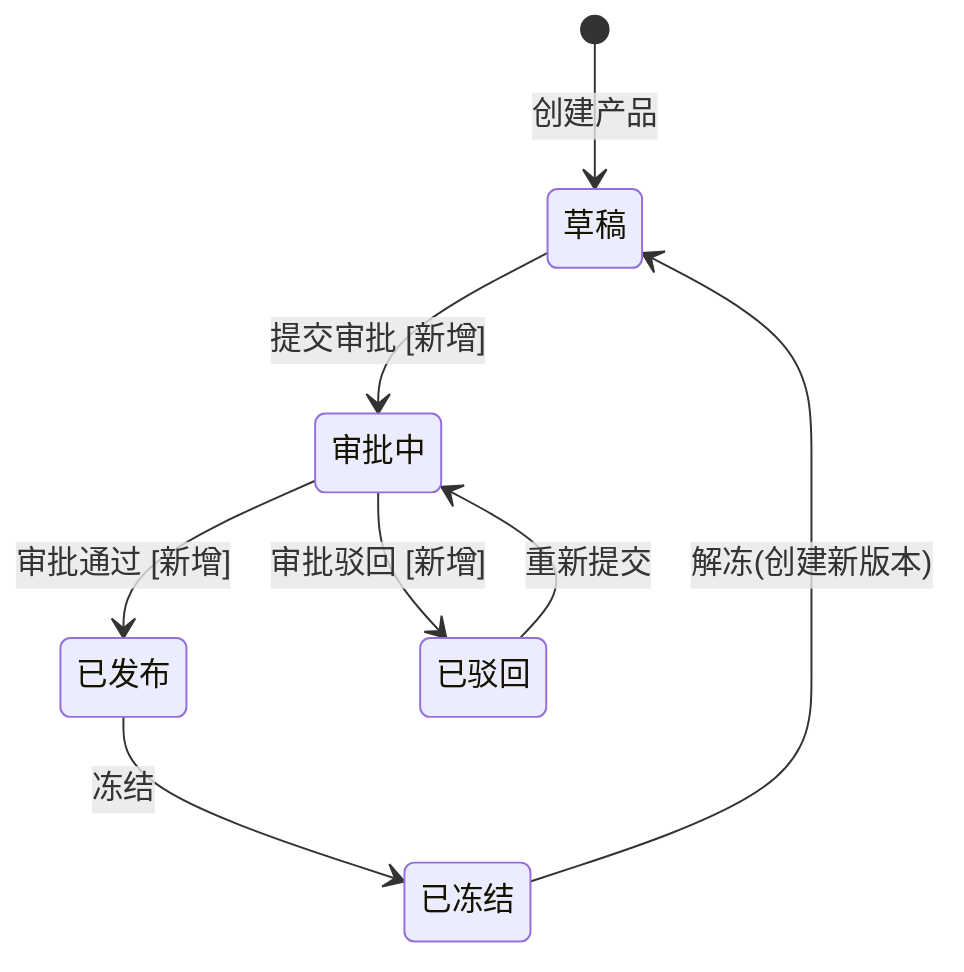
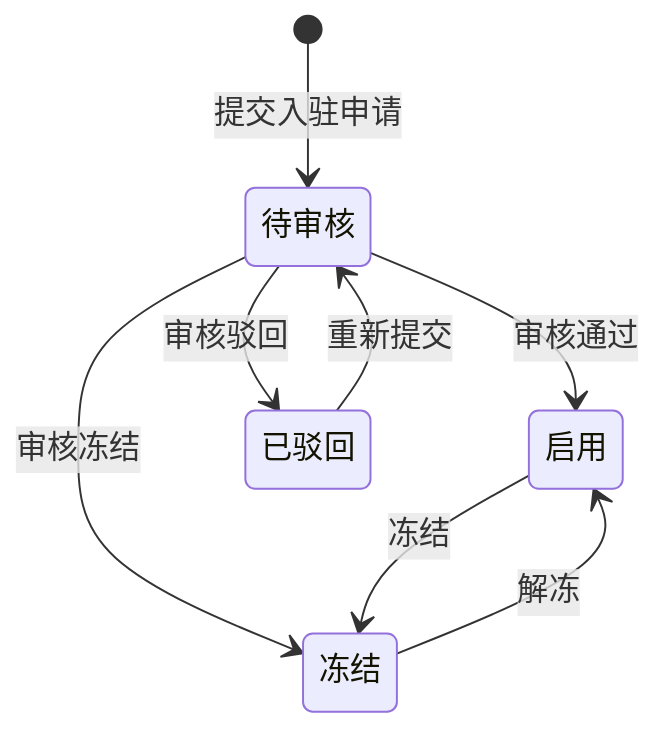
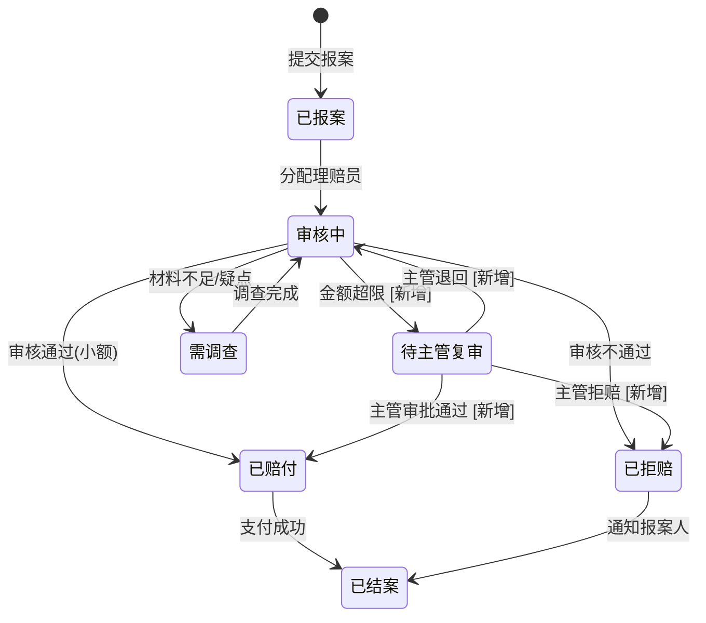

# Covex 需求补充规格

> **版本**：v1.0
> **来源**：E2E 端到端浏览器自动化测试 + 全量代码审计
> **日期**：2026-07-06
> **配套文档**：`Covex运营域需求规格.md`（主文档 v3.0）
> **方法论**：INVEST 用户故事 + BDD 验收标准 + MoSCoW 优先级

---

## 优先级说明

| 标记 | 含义 | 本轮范围 |
|---|---|---|
| **M** | MUST — 没有此功能系统不可用或流程断裂 | P0 阻塞 + P1 关键 |
| **S** | SHOULD — 影响体验或业务判断，应尽快补上 | P1 展示 + P2 审批 |
| **C** | COULD — 锦上添花，后续版本 | P3 架构优化 |

---

## 一、产品配置域补充

### Story P-1.1：产品创建引导流程 [M]

```
As a 产品管理员
I want to 在创建产品后通过分步引导完成保障定义、缴费计划、规则引用等配置
So that 产品配置完整，不会出现"创建了产品但无法投保"的情况

Acceptance Criteria:
Given 产品管理员创建了一个新产品（基本信息已填写）
When 系统检测到该产品缺少保障定义或缴费计划
Then 页面提示"产品配置不完整，请完成以下配置"
And 显示配置进度：✅ 基本信息 / ❌ 保障定义 / ❌ 缴费计划 / ⬜ 规则引用 / ⬜ 条款文档
And 点击任一步骤可跳转对应配置页面
And 所有必填项（保障定义 + 缴费计划）完成后，才允许点击"发布"按钮
```

**端到端流程**：
```
步骤1：创建基本信息 → 产品编码/名称/简称/类型/版本号
步骤2：配置保障定义 → 至少1条保障责任（编码/名称/选择模式/给付类型）
步骤3：配置缴费计划 → 至少1条缴费计划（编码/名称/频率/期限）
步骤4：关联保障与缴费 → 将保障责任和缴费计划关联
步骤5：配置规则引用（可选）→ 核保规则/费率计算规则
步骤6：配置条款文档（可选）→ 上传条款文件
步骤7：预览并提交 → 确认所有配置无误 → 提交审批
```

### Story P-1.2：产品发布审批 [M]

```
As a 产品审核员
I want to 审核产品配置后再批准发布
So that 不合格的产品配置不会进入生产环境

Acceptance Criteria:
Given 产品管理员完成产品配置并点击"提交审批"
When 产品进入审批流程
Then 产品状态变为"审批中"（versionStatus=4，新增状态）
And 审核员在产品列表看到"待审核"产品
And 审核员可查看产品完整配置（基本信息+保障+缴费+规则+条款）
And 审核员可"批准"（versionStatus→1已发布）或"驳回"（versionStatus→3已驳回+驳回原因）
And 审批记录写入 ins_product_changelog（operator=审核员账号）

Given 产品被驳回
When 产品管理员查看驳回原因
Then 可修改配置后重新提交审批
And 审批历史可追溯
```

**状态机补充**：
```
草稿(0) → 审批中(4): 提交审批
审批中(4) → 已发布(1): 审批通过
审批中(4) → 已驳回(3): 审批驳回
已驳回(3) → 审批中(4): 重新提交
```

### Story P-1.3：产品详情页数据修复 [M]

```
As a 产品管理员
I want to 在产品详情页看到完整正确的产品信息
So that 我能准确了解产品配置情况

Acceptance Criteria:
Given 产品已创建（如产品ID=13）
When 访问产品详情页 /product/{id}
Then 产品编码、名称、简称、类型、版本号正确显示（非空/非"未知"）
And 版本状态正确映射（0=草稿, 1=已发布, 2=已冻结, 3=已驳回）
And 启用/停用状态正确显示
And 创建时间、更新时间正确显示
And 保障定义 Tab 显示已配置的责任列表
And 缴费计划 Tab 显示已配置的计划列表
```

**根因**：后端 `GET /api/product/{id}` 返回 `{ product, coverages, premiums, rules }` 结构，前端 `loadProduct()` 应分别赋值：`product.value = res.data.product`，`coverages.value = res.data.coverages` 等。

---

## 二、渠道域补充

### Story C-2.1：渠道商入驻审批流程实现 [M]

```
As a 渠道审核员
I want to 审核新渠道商的资质申请
So that 只有合规的渠道商才能接入平台

Acceptance Criteria:
Given 渠道管理员填写渠道商信息并点击"提交审核"
When 渠道商进入审批流程
Then 渠道商状态变为"待审核"（status=3，新增状态）
And 系统记录提交时间
And 审核人员在待办列表看到该渠道商
And 审核员可"批准"（status→1启用/已签约）或"驳回"（status→4已驳回）或"冻结"（status→2）
And 审批操作记录审计日志（operator=审核员账号）

Given 渠道商被驳回
When 渠道管理员查看驳回原因
Then 可修改信息后重新提交审核
```

**状态机补充**：
```
现有：停用(0) / 启用(1) / 冻结(2)
新增：待审核(3) / 已驳回(4)

创建 → 待审核(3): 提交审核
待审核(3) → 启用(1): 审核通过
待审核(3) → 已驳回(4): 审核驳回
待审核(3) → 冻结(2): 审核冻结
已驳回(4) → 待审核(3): 重新提交
启用(1) ↔ 冻结(2): 管理员切换（需审批记录）
```

**前端变更**：
- ChannelList.vue：状态筛选增加"待审核""已驳回"选项
- ChannelCreate.vue：提交后状态为"待审核"而非直接"启用"
- ChannelDetail.vue：增加"审核通过""驳回"按钮（仅审核角色可见）

---

## 三、客户域补充

### Story U-3.1：客户角色标签展示 [S]

```
As a 业务人员
I want to 在客户列表中看到每个客户的角色类型（投保人/被保人/受益人）
So that 我能快速了解客户在业务中的身份

Acceptance Criteria:
Given 客户列表中有多条客户记录
When 页面加载完成
Then 每条客户记录显示"角色"列
And 角色列以标签形式展示：[投保人] [被保人] [受益人]（根据 role_flags 字段解析）
And 无角色的客户显示"-"
And 支持按角色类型筛选（筛选框：全部/投保人/被保人/受益人）

Given 客户A在投保单中作为投保人
When 投保单创建成功
Then 客户A的 role_flags 自动追加 "applicant"
And 客户列表中该客户显示 [投保人] 标签
```

**数据来源**：`ins_customer.role_flags`（JSON 数组，如 `["applicant","insured"]`）

**前端变更**：
- CustomerList.vue：增加"角色"列 + 角色筛选下拉框
- 解析 role_flags JSON，渲染为 el-tag 组件

---

## 四、承保域补充

### Story W-4.1：投保单保障与缴费选择 [M]

```
As a 代理人/投保人
I want to 在创建投保单时选择保障责任和缴费计划
So that 投保单包含完整的保障信息，能成功提交核保

Acceptance Criteria:
Given 代理人选择了产品（如"E2E全流程测试产品"）
When 产品选择变更时
Then 系统加载该产品的保障定义列表（GET /api/product/{id}/coverage）
And 系统加载该产品的缴费计划列表（GET /api/product/{id}/premium）
And 页面显示保障责任勾选区（复选框列表，必选保障自动勾选且不可取消）
And 页面显示缴费计划选择区（单选下拉）
And 每个保障责任旁显示保额输入框
And 提交投保单时，将 selectedCoverages 和 selectedPremiumPlan 一并提交

Given 代理人未选择任何保障责任
When 点击"提交"
Then 表单校验提示"请至少选择一个保障责任"
And 投保单不创建
```

**前端变更**：
- ProposalCreate.vue：
  - `onProductChange()` 方法加载产品保障列表和缴费计划
  - 表单新增 `selectedCoverages`（复选框+保额输入）和 `selectedPremiumPlan`（下拉选择）
  - `handleSubmit()` 将保障和缴费数据一并提交

### Story W-4.2：保费计算强制费率表校验 [S]

```
As a 系统
I want to 在保费计算时强制校验费率表是否存在
So that 保费计算结果有真实数据支撑，而非硬编码兜底值

Acceptance Criteria:
Given 投保单提交核保通过
When 系统执行保费计算
Then 从 Redis/DB 查询费率表数据
And 如费率表不存在 → 抛出业务异常"产品未配置费率表，无法计算保费"
And 不允许使用 0.003 硬编码兜底费率
And 费率查询链路：Redis → DB → 无数据则报错

Given 产品管理员为产品配置了费率表
When 保费计算执行
Then 使用真实费率计算保费 = 保额 × 费率
And 计算结果记录到 ins_proposal.total_premium
```

**后端变更**：
- PremiumCalculationService.java：移除 `new BigDecimal("0.003")` 兜底逻辑
- 费率表不存在时抛出 BizException

---

## 五、理赔域补充

### Story L-5.1：理赔多级审核机制 [S]

```
As a 理赔主管
I want to 设置不同角色的审核金额权限
So that 大额理赔需要更高级别审批，控制赔付风险

Acceptance Criteria:
Given 理赔员完成初审并做出"正常赔付"结论
When 批准金额 ≤ 理赔员权限阈值（如 10,000 元）
Then 审核直接生效 → 进入赔付流程
When 批准金额 > 理赔员权限阈值
Then 案件自动升级到理赔主管复审
And 理赔主管可查看初审结论和材料
And 理赔主管可"同意"或"调整金额"或"退回"

Given 理赔主管完成复审
When 批准金额 ≤ 主管权限阈值（如 100,000 元）
Then 审核生效 → 进入赔付流程
When 批准金额 > 主管权限阈值
Then 案件升级到总经理审批（三级审核）
```

**审核层级配置**（建议默认值）：

| 角色 | 审批权限上限 | 可执行操作 |
|---|---|---|
| 理赔员 | 10,000 元 | 初审、小额赔付 |
| 理赔主管 | 100,000 元 | 复审、中额赔付 |
| 总经理 | 无上限 | 终审、大额赔付 |

**状态机补充**：
```
审核中(3) → 待主管复审(10): 金额超限自动升级 [新增状态]
待主管复审(10) → 待赔付(5): 主管审批通过
待主管复审(10) → 审核中(3): 主管退回补充材料
待主管复审(10) → 已拒赔(8): 主管拒赔
```

**前端变更**：
- ClaimDetail.vue：增加"待主管复审"状态显示和主管审批按钮
- 理赔列表增加"待我审核"过滤器

---

## 六、前端展示补充（系统性）

### Story F-6.1：外键ID替换为业务名称 [M]

```
As a 业务用户
I want to 在列表和详情页看到有意义的业务名称而非数据库ID
So that 我能快速理解数据含义，不需要记忆ID对应关系

Acceptance Criteria:
Given 以下页面存在外键ID显示问题
When 页面加载完成
Then 所有外键ID列替换为（或增加）关联实体的业务名称

具体修改清单：
┌─────────────────┬──────────────┬────────────────────────┐
│ 页面             │ 当前显示      │ 应显示                  │
├─────────────────┼──────────────┼────────────────────────┤
│ 理赔列表         │ policyId     │ 保单号（policyNo）       │
│ 理赔详情         │ policyId     │ 保单号                  │
│ 理赔详情         │ coverageId   │ 保障名称                │
│ 理赔详情         │ reporterId   │ 报案人姓名              │
│ 投保单详情       │ applicantId  │ 投保人姓名              │
│ 投保单详情       │ insuredId    │ 被保人姓名              │
│ 投保单详情       │ channelId    │ 渠道商名称              │
│ 投保单详情       │ channelUserId│ 渠道用户姓名            │
│ 保单列表         │ applicantId  │ 投保人姓名              │
│ 保单列表         │ insuredId    │ 被保人姓名              │
│ 核保列表         │ applicantId  │ 投保人姓名              │
└─────────────────┴──────────────┴────────────────────────┘

实现方案：
方案A（推荐）：后端 DTO 增加名称字段（如 applicantName、insuredName）
方案B：前端加载数据后批量查询名称（N+1 问题，不推荐）
```

### Story F-6.2：费率查询业务化改造 [S]

```
As a 业务人员
I want to 通过选择产品和输入条件来查询费率
So that 我不需要知道表编码和维度键的技术细节

Acceptance Criteria:
Given 业务人员进入费率查询页面
When 页面加载
Then 显示"产品选择"下拉框（而非"表编码"输入框）
And 选择产品后，自动关联该产品的费率表
And 显示"年龄"输入框（数字输入）
And 显示"性别"选择框（男/女）
And 显示"保额"输入框（可选）
And 点击"查询"后，显示对应费率和计算出的参考保费

Given 用户选择产品"E2E全流程测试产品"，年龄30，性别男，保额10万
When 点击查询
Then 显示：费率 0.003000，参考年缴保费 300.00 元
```

**前端变更**：
- RateQuery.vue：重构为业务友好型界面
  - 产品选择下拉框（替代表编码输入）
  - 年龄/性别/保额输入（替代维度键输入）
  - 结果展示：费率 + 计算后参考保费

---

## 七、架构层面补充

### Story A-7.1：MQ Consumer 补全 [C]

```
As a 系统
I want to 在保单出单后自动计算佣金
So that 渠道商佣金记录准确且及时

Acceptance Criteria:
Given 投保单出单成功，发送 POLICY_ISSUED 消息
When PolicyIssuedConsumer 消费该消息
Then 自动调用 CommissionService.calculateCommission()
And 创建 ins_commission 记录
And 消费失败时重试3次，最终进入死信队列

Given 理赔赔付完成，发送 CLAIM_PAID 消息
When ClaimPaidConsumer 消费该消息
Then 记录赔付通知日志
And 更新相关统计数据
```

### Story A-7.2：支付超时 MQ 延迟消息 [C]

```
As a 系统
I want to 在创建支付记录时发送30分钟延迟消息
So that 超时未支付的投保单自动撤销

Acceptance Criteria:
Given 支付记录创建成功
When PaymentService.createPayment() 执行
Then 发送 RocketMQ 延迟消息（delayLevel=30分钟）到 PAYMENT_TIMEOUT topic
When PaymentTimeoutConsumer 消费该消息
Then 检查投保单状态是否仍为"待支付"(4)
And 如是 → 投保单状态→已撤销(8)，释放核保占用
And 如否（已支付）→ 忽略

Given 支付回调在超时前到达
When 投保单状态已变为"已支付"(5)
Then 延迟消息消费时检测到状态变化，不做处理
```

### Story A-7.3：权限体系落地 [C]

```
As a 系统管理员
I want to 方法级权限校验和数据权限隔离真正生效
So that 不同角色的人员只能访问授权范围内的功能和数据

Acceptance Criteria:
Given @RequiresPermission 注解已标注在 Controller 方法上
When PermissionAspect 拦截请求
Then 从 Redis 获取当前用户权限集（key: user:perm:{userId}，TTL 30分钟）
And 校验用户权限集是否包含所需权限码
And 不包含 → 返回 403

Given DataPermissionInterceptor 已注册
When MyBatis 执行查询
Then 根据当前用户角色+数据范围自动追加 SQL 条件
And 如：渠道商用户只能看到自己渠道的数据
And 如：区域管理员只能看到自己区域的数据

Given 用户权限变更（如角色分配/权限修改）
When 变更操作完成
Then 清除相关用户的 Redis 权限缓存
```

---

## 八、状态机汇总补充

### 8.1 产品版本状态机（补充审批中状态）



### 8.2 渠道商状态机（补充审核状态）



### 8.3 理赔审核状态机（补充多级审核）



---

## 九、补充需求与主文档映射

| 补充 Story | 对应主文档 | 补充内容 |
|---|---|---|
| P-1.1 产品创建引导 | 主文档无 | 新增 Epic |
| P-1.2 产品发布审批 | 主文档无 | 新增 Story + 状态机 |
| P-1.3 产品详情数据修复 | 主文档无（Bug） | 前端 Bug 修复 |
| C-2.1 渠道审批实现 | Story 1.1 已定义 | 补全代码实现 |
| U-3.1 客户角色标签 | Story 2.2 部分覆盖 | 前端展示补全 |
| W-4.1 投保保障选择 | Story 3.1 已定义 | 前端表单补全 |
| W-4.2 保费强制费率 | Story 3.3 已定义 | 后端逻辑修正 |
| L-5.1 理赔多级审核 | Story 6.2 部分覆盖 | 新增金额权限 |
| F-6.1 ID替换名称 | 主文档无（系统性Bug） | 5+ 页面修复 |
| F-6.2 费率查询改造 | 主文档无 | 前端重构 |
| A-7.1 MQ Consumer | 主文档无 | 新增 Consumer |
| A-7.2 支付超时MQ | Story 11.1 已定义 | 补全代码实现 |
| A-7.3 权限体系 | Story 7.1/7.2 已定义 | 补全代码实现 |
